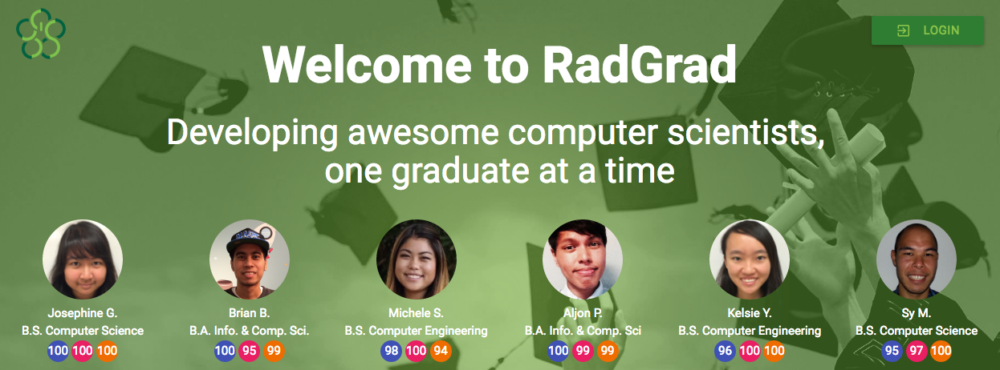

# Why RadGrad?

We believe that the discipline of computer science evolves faster and is more pervasive than any other. "Data science" became an important area of academic study in just a few years. Self-driving cars is now an industry, but it was a research project five years ago.

Even the teaching of computer science is subject to frequent disruption. The first course taught as a "Massively Online Open Course" (MOOC) was Artificial Intelligence. A recent trend is the "coding bootcamp", a short, intensive, high-cost, non-university traineeship to help non-programmers quickly develop simple web application development skills. For some, bootcamps call into the question the return-on-investment of a four year university degree in computer science.
 
Virtually no intellectual discipline is untouched by computer science. Indeed, many departments of computer science have renamed themselves as departments (or Colleges) of "Information", recognizing the more fundamental nature of the field. 

The rate of change and pervasiveness of computer science creates issues for today's students.  Focal areas can evolve significantly from the time a student enters university to the time they graduate. For example, seniors in Computer Science in 2016 might be questioned during interviews about "deep learning", a term that did not exist four years earlier when they started taking classes. 

A second issue is the complementary nature of computer science with other disciplines: there is no "natural" second area of study with computer science because *every* other area goes well with computer science. This limitless choice creates its own set of issues: how can the student maximize the combination of disciplines, find peers with similar interests, and find faculty who can help them integrate two (or even more) disciplines effectively? 

RadGrad attempts to improve the computer science degree experience through technology that enables students to: (1) better understand the discipline and how it can relate to their interests and goals; (2) become more engaged with fellow students, faculty, and community members who share their interests, resulting in students (3) embarking upon projects both inside and outside the classroom that produce a richer and more comprehensive knowledge of the discipline.  We hypothesize that the above goals should positively impact student demographics and outcomes: there should be (4) more diversity in student makeup and interests, and (5) upon graduation they should have more and better opportunities.

