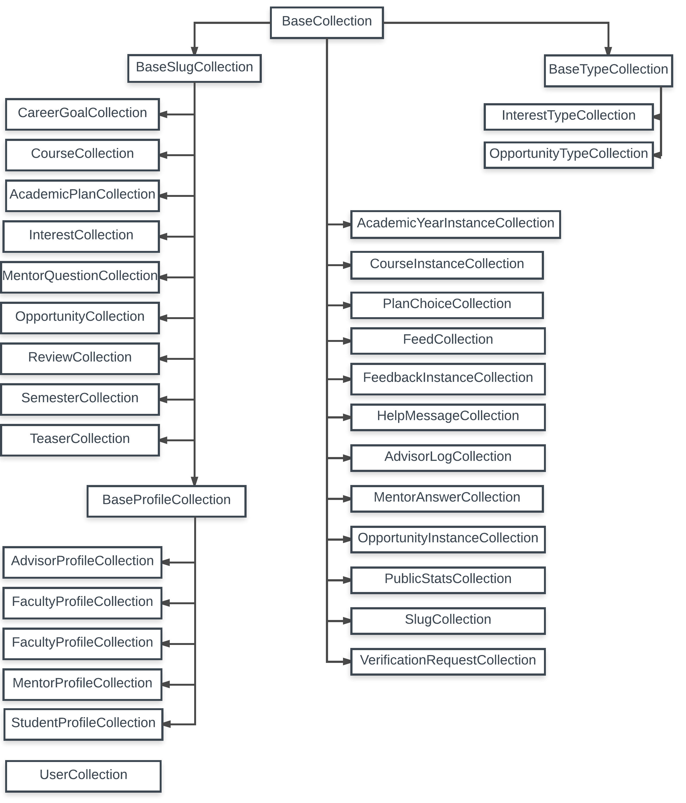

# Class Hierarchy

Recall that every MongoDB collection is encapsulated by a Javascript class with the same name. 

As we implemented this encapsulation, we observed that there was common functionality that could be abstracted out into a set of four superclasses:

  * *BaseCollection*.  All classes (with the single exception of the UserCollection class) inherit either directly or indirectly from BaseCollection. This class provides the methods and fields used to manage a MongoDB collection that are common across RadGrad.
  
  * *BaseTypeCollection*.  This class extends BaseCollection with methods to support MongoDB collections that specify "types" in RadGrad.  Currently, there are two such types: InterestTypes and OpportunityTypes.
  
  * *BaseSlugCollection*.  This class extends BaseCollection with methods to support the MongoDB collections whose documents must include a "slug". For more details, see the section on [slugs](entity-relationship-model.html#slugs).
  
  * *BaseProfileCollection*.  This class extends BaseSlugCollection with the methods common to the implementation of the collections to support RadGrad roles: AdvisorProfileCollection, FacultyProfileCollection, MentorProfileCollection, and StudentProfileCollection.

Here is the resulting class hierarchy:

There is one exceptional class: UserCollection, which does not inherit from any of the Base classes.  This is because the UserCollection class encapsulates a "special" MongoDB collection managed by the Meteor.Accounts package. The behavior of this collection is sufficiently different from regular user-defined collections that we did not feel it was appropriate to make it a subclass of any other class. 