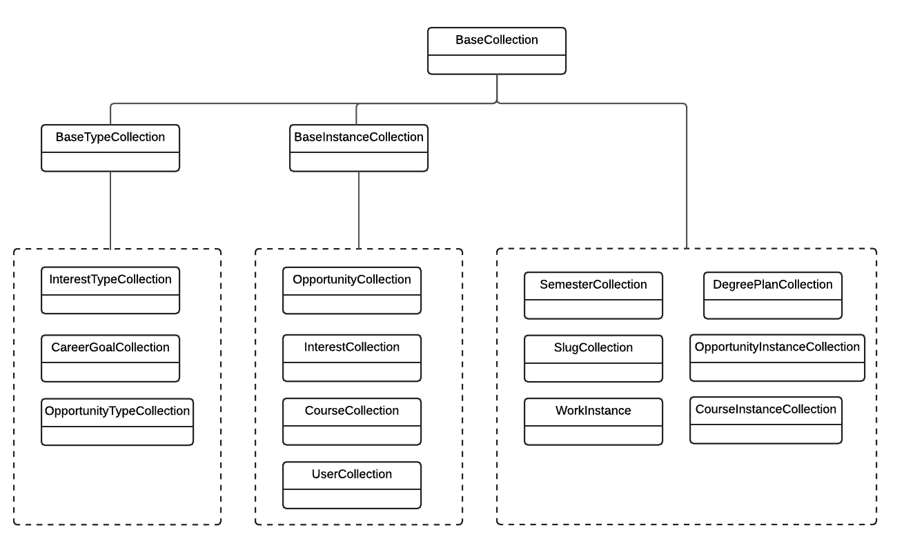

# Class Hierarchy

The implementation of the above entities involves a great deal of common functionality.  For example, all of these entities require a means to look up the document based upon the docID, and to determine whether or not a given docID represents an entity of a given type. 

To encapsulate this shared functionality, RadGrad implements a class hierarchy which starts with a set of three "Base" classes: BaseCollection, BaseTypeCollection, and BaseInstanceCollection. All of the RadGrad entities are direct subclasses of one of these three Base classes depending upon what kind of shared functionality they need to inherit from a superclass. The following diagram illustrates how all of the RadGrad entity classes inherit from one of the three Base classes:

In general, the BaseCollection superclass contains fields and methods useful to every RadGrad entity. The BaseTypeCollection superclass inherits from BaseCollection, and factors out the structure common to the "Type" entities. The BaseInstanceCollection superclass inherits from BaseCollection, adds methods useful to the remaining entities as well as not imposing a predefined field structure.