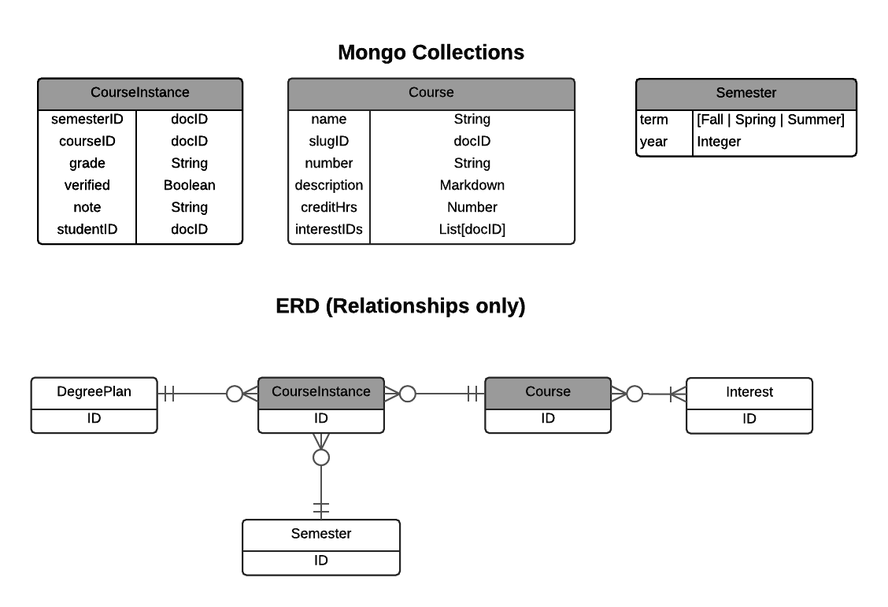

# Course

Courses are represented through a combination of three entities.  The "Course" entity represents information about a course that is (assumed to be) "invariant"---its description, credit hours, name, and number.
 
CourseInstances represent the experience of a specific student taking a course in a specific semester (and eventually obtaining a grade).  

Finally, the Semester entity provides a convenient way to represent semesters.

The [ICS Syllabus Page](http://courses.ics.hawaii.edu/syllabuses/) provides the list of courses managed in RadGrad.

The set of Courses are defined and managed by RadGrad admins. 

Historical CourseInstance data is provided by uploading data from STAR. Current and future CourseInstance data is provided by the student user.