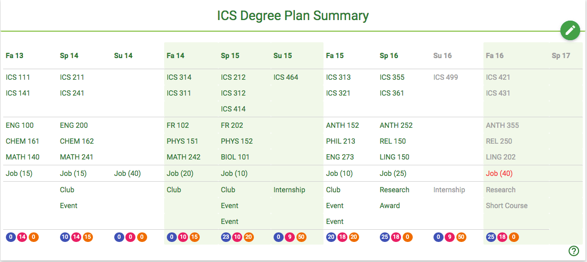

# Degree Plan

The degree plan represents past, present, and future (i.e. planned) courses, opportunities, and outside work obligations on a semester-by-semester basis. 

The plan is composed of a set of "instances" which tie a course, opportunity, and outside job to a specific semester and student.

The degree plan contains both historical (past) and projected (future) semester data on courses, activities, and work. It also provides information on the student's ICE score. 

Here is an mockup degree plan for a student who has almost completed their ICS degree. It represents their plan at the conclusion of Spring 2016, with three more semesters remaining before the student expects to graduate:

This image shows what a "complete" degree plan might look like. A fundamental RadGrad design issue is how a student, in concert with an advisor, develops and manages their plan over the course of their degree program.  The above screenshot illustrates how the degree plan might be presented in "read-only" format on the student's home page.  The pencil button in the corner represents a link to a page where the plan can be edited by the student and/or their advisor.  

Here are some important issues for the degree plan designer:

**Historical data on courses is non-editable and imported from STAR.** We want to ensure that RadGrad is not inconsistent with STAR, so each time a student visits with their advisor, the advisor can "refresh" the student's RadGrad account with their latest course history data from STAR. 

**Future data on courses is editable by student or advisor.** We want each student to be able to plan out future semesters and perform "what-if" scenarios, either independently or with an advisor. Therefore, course data for future semesters can be edited.

**Work and Opportunity data can be edited from any time period.** We anticipate students forgetting to enter Opportunity or Work data from prior semesters.  Therefore, work and opportunity data can be edited from any time period.

**Historical opportunity data must be verified by an advisor or faculty member before Innovation or Experience points are awarded.**  To avoid ICE values from becoming meaningless, student participation must be verified. For competency (i.e. course) points, verification that the course was taken and that a particular grade was received is done via advisor import of STAR data.  For Innovation and Experience points, which arise from participation in Opportunities, an advisor or faculty member must verify all claims from prior semesters.  Future semester data is used for "what if" scenario so the points are not verified. 

**Courses can be recommended.**  The degree planner should provide a mechanism to recommend courses based upon: (a) the requirement that a course be taken due to the chosen degree plan; (b) the relevancy of a course based upon the student's indicated career goals and interests. 
  
**Opportunities can be recommended.** Certain opportunities can be recommended based upon: (a) its relevency to the student's indicated career goals and interests, or (b) the need for a student to acquire points in either Innovation or Experience areas.
 
**Warnings should appear for problematic choices.** The degree planner should provide feedback when it detects certain kinds of problems in the current degree plan. The planner should not prevent choices, but merely issue a "warning".  Such warnings can include:
 
* Taking courses without the required prerequisites.
* Overloading: taking too many courses, or working too many hours at a job with a heavy class load.
* Not taking enough courses per semester to graduate in four years. 
* Specifying a historical Opportunity that has not yet been verified by an advisor.
* Not having up-to-date STAR data.

