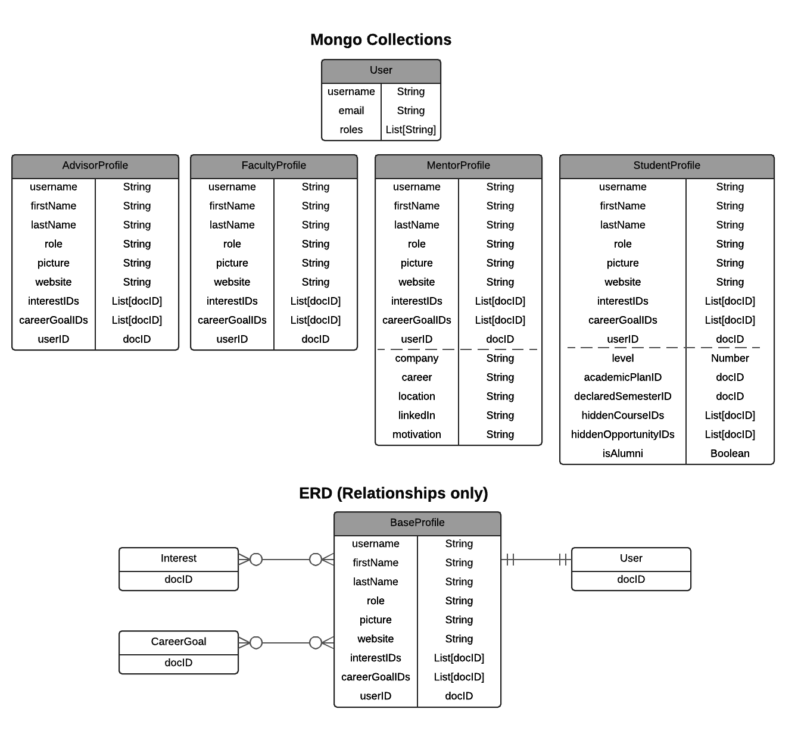
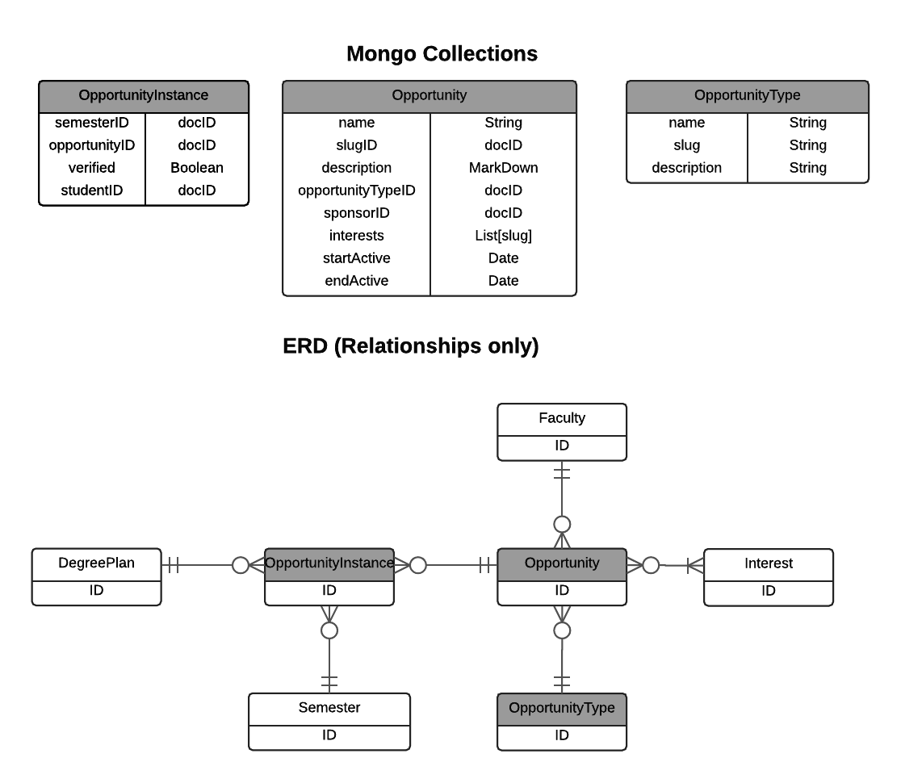
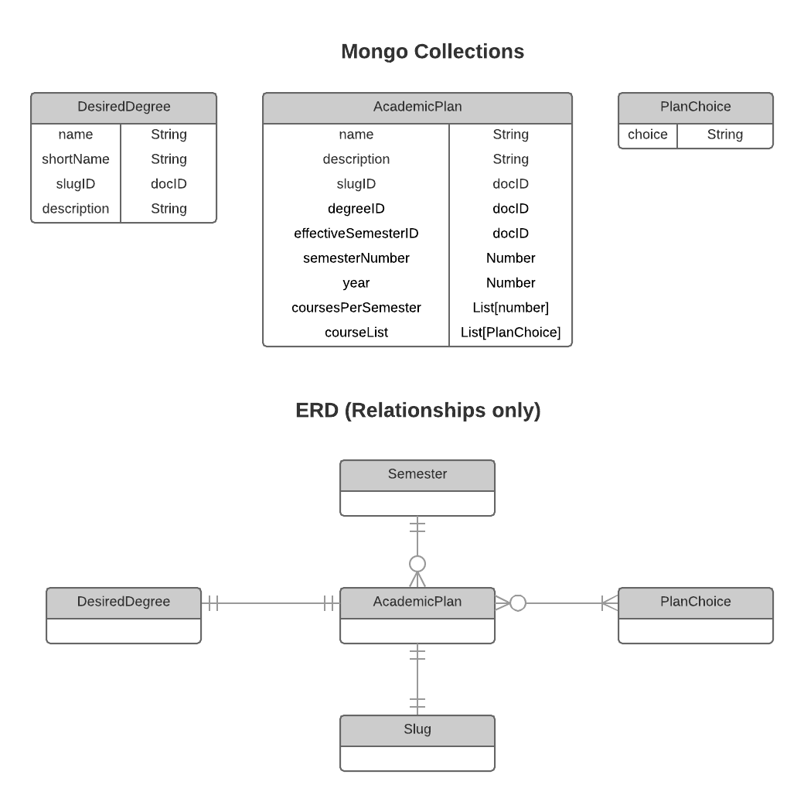

# Entity-Relationship Model

The prior section illustrated the relationships between the data model entities in terms of class inheritance. That perspective reveals how code is shared.

This section documents the direct relationships between data model entities.  Depending upon your perspective, you might think of these references as "pointers", "foreign keys", or "references".  For example, each document in the CourseInstance collection needs to refer to a specific Semester in which the course instance occurs, a specific student who has/is/will be taking the course, and a specific Course. These references are implemented via fields in the CourseInstance document that hold the docID to a document in the other entity's collection. So, each CourseInstance document has the following fields (among others): SemesterID, StudentID, and CourseID.

## Users and Profiles {#users}

One of the more complicated representations in RadGrad is a user. (This is unfortunate, but the following complicated representation is the simplest one we could come up with that works effectively.)

 

Each user in RadGrad is represented in two ways.  The first way is as a document in the Meteor Users collection.  Meteor provides a built-in accounts package which we use for authentication and authorization which provides this Users collection. So, in order for someone to be able to login to RadGrad, they must exist as an entry in the Users collection.   The Users collection has a very simple representation: each user has a username, which is their email address. In addition, each user has an email field, which is also their email address, and a roles field, which is managed by the standard Roles package. 

RadGrad does not augment the documents in the User collection with all of the additional properties we need to know about users. Meteor does not recommend doing this, and after previous experience, we evolved to the current representation in which we keep a separate set of collections to manage the properties associated with users.  For this purpose, RadGrad provides a set of four "Profile" collections, each of which corresponds to a role in RadGrad: StudentProfile, FacultyProfile, MentorProfile, and StudentProfile.

Because there are nine properties that every user has (username, firstName, lastName, role, picture, website, interestIDs, careerGoalIDs, and userID), RadGrad provides a class called BaseProfileCollection to manage these properties. This class is not shown in the above diagram. Instead, the four Profiles have the same initial nine properties.  The MentorProfile and StudentProfile have some additional properties which are illustrated below the dotted line in their representation. 

Each RadGrad user must fall into one of five roles: Student, Faculty, Mentor, Advisor, or Admin.  There is a "Profile" collection associated with each of the first four roles, but the Admin role has no profile associated with it.

The ERD in the illustration only shows the relationships for the common properties shared across all profiles, i.e. the "base" profile. As you can see, every profile has a link back to the corresponding document in the Users collection for this user, as well as references to their CareerGoals and Interests.  To find a profile given only the User document, you must search for the matching username in each of the four Profile collections. 

## Courses {#courses}

RadGrad represents courses through two entities: Course and CourseInstance.

 
 
Course represents semester and student-independent information about a course. 

CourseInstance represents the occurrence of a specific student taking a course for a specific semester, either in the past, present, or future. If the CourseInstance is in the past, then typically it was created as a result of uploading STAR data, in which case both the fromSTAR and verified booleans are set to true. A verified CourseInstance means that the student will earn ICE points. 

CourseInstances in the present semester or future semester are typically created as a result of the student manipulating their degree plan. These CourseInstances have their fromSTAR and verified booleans set to false.  

## Opportunities {#opportunities}

In RadGrad, extracurricular events and activities are called "Opportunities", and are represented by three entities: Opportunity, OpportunityType, and OpportunityInstance. 

 
 
OpportunityType specifies the kind of Opportunity: club, event, online course, etc.

Opportunity represents the opportunity "in the abstract", specifying its description, sponsor (i.e the faculty member responsible for managing the description and verifying student participation), the ICE points, the semesters it might be available, etc.

OpportunityInstance represents an "instantiation" of the Opportunity in a specific semester for a specific student. It also duplicates the ICE points and the sponsorID from the Opportunity. This enables an instance to depart from its parent Opportunity with respect to these values, and also speeds lookup.

## Academic Plans {#academic-plans}

To understand RadGrad's Academic Plans, it's important to understand how degree programs work.  In general, departments establish degree programs such as "B.S. in Computer Science", "B.A. in Information and Computer Science", or "B.S. in Computer Science with a Security Science Specialization".  Each degree program has a set of requirements associated with it, such as the courses that must be taken, and/or the grades that must be achieved, and/or the total number of credit hours.  

In addition, degree programs evolve over time.  So, let's say a B.S. in CS is established in 2015 with a set of requirements.  Then, in 2017, the faculty votes to change those requirements to improve the quality or timeliness of the degree program. Students who have already declared their major as the B.S. in CS now have a choice: they can continue with the degree requirements in place at the time they started (i.e. the 2015 requirements) or they can switch to the new requirements (the 2017 requirements). 

RadGrad's Academic Plans provide a way to represent the evolving nature of degree programs:

A "DesiredDegree" is an entity representing a degree plan such as "B.S. in Computer Science".  A set of "PlanChoices" represent the requirements for that desired degree.  The Semester indicates the time at which an Academic Plan comes into being.  The Slug just assigns the AcademicPlan a unique string identifier, such as "BS-Computer-Science-2017".

 

