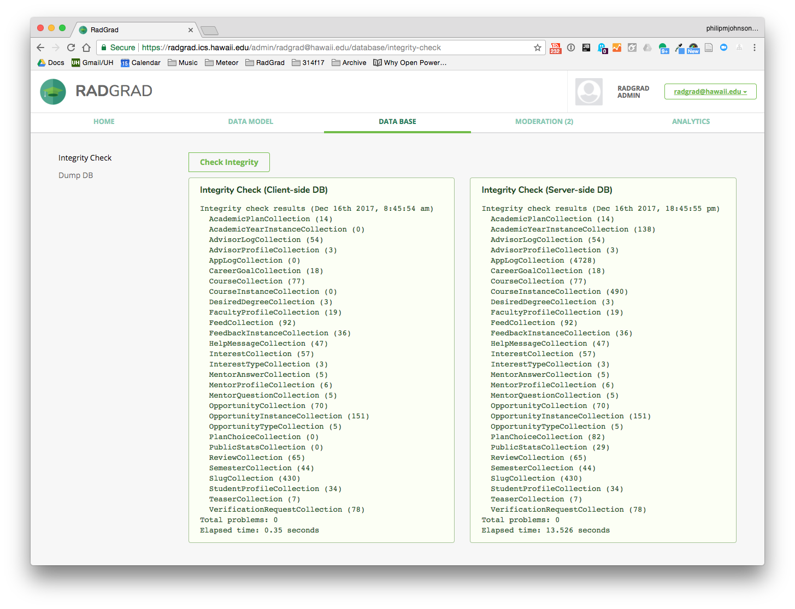

# Integrity Checking

Compared to relational database systems, MongoDB has very little support for ensuring the integrity of data models. For example, CareerGoal documents contain a slugID field that should contain the docID of a document in the Slug collection, and an interestIDs field that contains a list of docIDs of documents in the Interest collection.  Now, if we were using a relational database system, the system itself would ensure that the integrity of these relationships between CareerGoals, Slugs, and Interests are satisfied (in other words, that those docIDs do point to entities in the correct collection). In contrast, in MongoDB, those field values are basically just strings, and it is left up to the developer to ensure that those strings are in fact docIDs in the appropriate collections.

This looseness in MongoDB was sufficiently scary that we decided to build an "Integrity Checking" mechanism into RadGrad.  The idea is that each class in the data model should define a method called "checkIntegrity()", which is responsible for checking every document in its associated collection to ensure that fields have the correct kind of value. The method returns an array, which, if empty, indicates that there are no integrity issues with the documents in the collection at this point in time.  If the array is non-empty, then it contains one or more strings that provide information about the integrity problem(s) detected in the collection.

Here, for example, is the checkIntegrity method for the CareerGoal class, which checks to make sure that the slugID field contains a docID for a Slug document, and that if the interestIDs field is non-empty, then its elements are docIDs of documents in the Interest collection: 


```js
 /**
   * Returns an array of strings, each one representing an integrity problem with this collection.
   * Returns an empty array if no problems were found.
   * Checks slugID and interestIDs.
   * @returns {Array} A (possibly empty) array of strings indicating integrity issues.
   */
  checkIntegrity() {
    const problems = [];
    this.find().forEach(doc => {
      if (!Slugs.isDefined(doc.slugID)) {
        problems.push(`Bad slugID: ${doc.slugID}`);
      }
      _.forEach(doc.interestIDs, interestID => {
        if (!Interests.isDefined(interestID)) {
          problems.push(`Bad interestID: ${interestID}`);
        }
      });
    });
    return problems;
  }
``` 

You can invoke the Integrity Checking system manually from the Administrator account. Here's what happens after pressing the "Check Integrity" button:



Because Meteor maintains a MongoDB database on both the client and server sides, the Integrity Checker runs twice, once on the client and once on the server, and reports both results. It is useful to note that if you subscribe to a subset of the database, it is possible to find integrity problems on the client side but not on the server side. For example, you might subscribe to a User document that contains a field with InterestIDs without subscribing to the Interest collection in a way that does not replicate one or more of those InterestIDs to the client.   

The Integrity Checking mechanism also runs automatically on startup to ensure that database integrity is satisfied. If problems are found, they are reported to the server console.