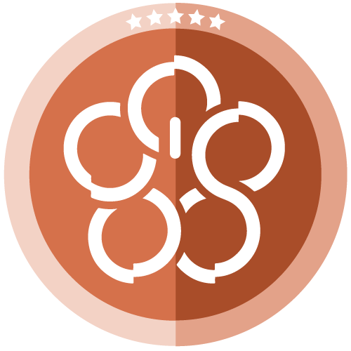

# How RadGrad Student Level Calculation Works

A feature of RadGrad is the student levels.  As students progress through their degree program, RadGrad recognizes their development through six levels, represented by the colors grey, yellow, green, blue, brown, and black. We shroud the exact requirements to achieve certain levels in mystery. The level help describes the levels as follows.

#### LEVEL 1: Gray  

You begin your RadGrad experience at Level 1, and you will receive this laptop sticker when you first sign up for RadGrad with your advisor. *\"A journey of a thousand miles begins with a single step\" -- Lao Tzu*

#### LEVEL 2: Yellow 

Successfully finish your first semester of ICS coursework. Then meet with your advisor and ask him/her to update RadGrad with your current STAR data. That should bring you to Level 2, and earn you the Level 2 laptop sticker.

#### LEVEL 3: Green 

With any luck, you'll achieve Level 3 after you complete your second semester of ICS coursework, as long as your grades are good. As before, meet with your Advisor to update RadGrad with your current STAR data, and if the system shows you've gotten to Level 3, you'll get your Green laptop sticker.

#### LEVEL 4: Blue 

ICS has a "core curriculum", and Level 4 students have not only finished it, but they have also thought beyond mere competency. Once your current STAR data is in RadGrad, and you've achieved some verified opportunities, you might just find yourself at Level 4! Meet with your advisor to pick up your sticker, and bask in the glory it will bring to you!

#### Level 5: Brown 

Level 5 students are far along in their degree program, and they've made significant progress toward 100 verified points in each of the three ICE categories.  You will probably be at least a Junior before Level 5 becomes a realistic option for you. Keep your STAR data current in RadGrad, make sure your opportunities are verified, and good luck! Some students might graduate before reaching Level 5, so try to be one of the few that make it all the way to here!
 
#### Level 6: Black 
 
If you achieve Level 6, you are truly one of the elite ICS students, and you will have demonstrated excellent preparation for entering the workforce, or going on to Graduate School, whichever you prefer.  Congratulations!   Note that in addition to fulfilling the ICE requirements, you'll also need to "pay it forward" to the RadGrad community in order to obtain your Black RadGrad laptop sticker.

### Level Calculation Files

In the `imports/api/level` directory we have most of the JavaScript for calculating student levels.  

* The `LevelProcessor.js` file provides 3 functions for calculating student levels.

  1. `defaultCalcLevel` which takes a studentID.  This is an example level calculation function. It hard codes the values needed to obtain the different levels.
  2. `updateStudentLevel` which takes an advisorID and studentID. Recalculates the student's level and if it is changes sends an advisor log to the student telling them to pick up their new sticker.
  3. `updateAllStudentLevels` which takes an advisorID. This function updates all the students' levels.
  
* The `LevelProcessor.methods.js` file provides ValidatedMethods so that clients can update student levels. We have 3 ValidatedMethods for student levels.

  1. `calcLevelMethod` allows the client to calculate a single student's level.
  2. `updateLevelMethod` allows the client to update a student's level.
  3. `updateAllStudentLevelsMethod` allows the client to update all the students' level.
  
#### Hiding the level calculation

To keep the mystery of how to gain levels the `updateStudentLevel` method has the following code:

      if (RadGrad.calcLevel) {
        level = RadGrad.calcLevel(studentID);
      } else {
        level = defaultCalcLevel(studentID);
      }

This allows us to attach a function `calcLevel` to the RadGrad object. If it exists we will use it to calculate the level.  We also have a .gitignored directory `app/custom`. You can put code in that directory that meteor will load and execute, but will not be stored in the public GitHub repository. 

Here is an example of how you can change the level calculation. In the `app/custom` directory place a JavaScript file with the following contents:

    import { RadGrad } from '../imports/api/radgrad/RadGrad';
    
    RadGrad.calcLevel = function calcLevel(studentID) {
      return 2;
    }
    
This is a very poor example of a student level calculation, but you could use any logic you want to determine the student's level.

#### Using ICE values in level calculation

Another approach to hiding the exact values need for each level is to tie them to ICE points.  In our `settings.production.json` and `settings.development.json` files we add the following structure.

        "level": {
          "six": {"i": 90, "c": 90, "e": 90},
          "five": {"i": 75, "c": 75, "e": 75},
          "four": {"i": 25, "c": 40, "e": 25},
          "three": {"i": 1, "c": 24, "e": 1},
          "two": {"i": 0, "c": 12, "e": 0}
        }
 
This way in our custom level calculation function we can refer to the properties by using 
 
       if (ice.i >= Meteor.settings.public.level.six.i &&
           ice.c >= Meteor.settings.public.level.six.c &&
           ice.e >= Meteor.settings.public.level.six.e) {
         level = 6;
       }
       
To set the levels. Now we can edit the settings files and change the requirements without having to change the level calculation function. 