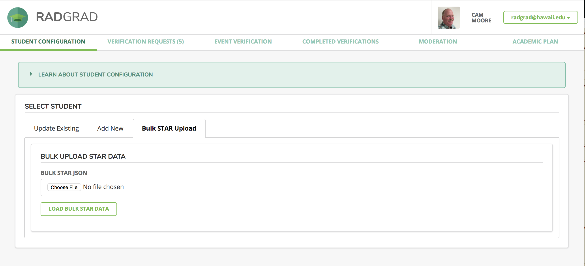
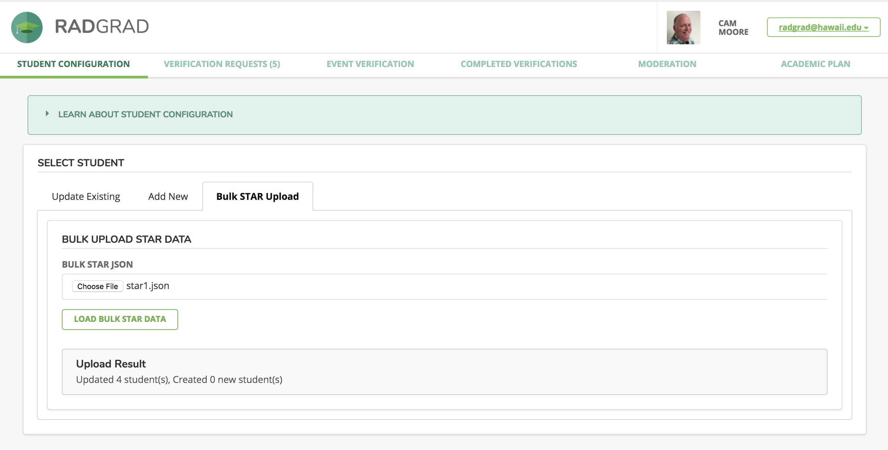

# Importing Bulk STAR Data

To help *improve the undergraduate degree experience* we need a way to quickly update the students' STAR data. 


### Setting up the Bulk STAR download script.

After following the [instruction to install RadGrad](installation.md), cd to the radgrad/scripts/ directory and invoke npm:

```
scripts$ npm install
```

This will download and install the third-party libraries required to download students' STAR data.

### Downloading STAR data.

Create a text file named *emails.txt*. This file should have the email addresses of the students you want to download their STAR data. This file is ignored by GIT. The email addresses must be on separate lines.

Then run the download-bulk-star-json.js file. You will be asked to enter your UH username, password and the name of the file to store the STAR data.
```
scripts$ node download-bulk-star-json.js 
? Enter your UH username: cmoore
? Enter your password: [hidden]
? Enter the file name to save the data to star1.json
scripts$
```

### Uploading STAR data to RadGrad.

Login to RadGrad as an Advisor. Go to the Student Configuration page, Bulk STAR Upload tab.



Choose the file with the downloaded STAR data and press the LOAD BULK STAR DATA button. RadGrad will tell you how many students were updated or created.


