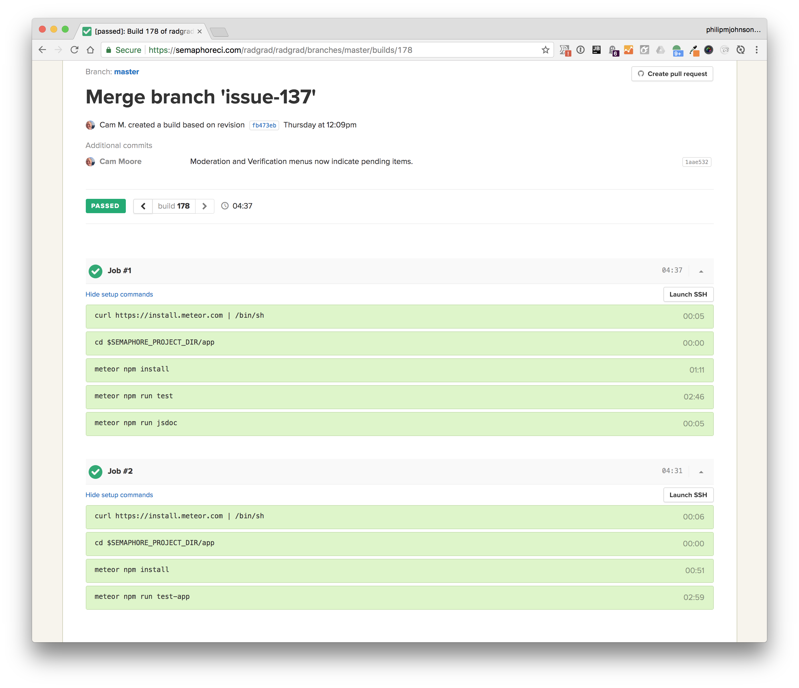

# Testing

RadGrad provides "unit" and "integration" tests. Both are designed to be run from the command line and useful for continuous integration. 

Unit tests are tests that run only on the server side, and which focus on verifying that the RadGrad data model (i.e. the set of Collection classes) work as intended.
  
Integration tests run from the client side, and test to ensure that client-server interactions work as intended. Currently, integration tests only check that Meteor method implementations function correctly. We do not yet have UI tests, such as tests that would be implemented using Selenium or some other browser driver. 

We use the [Mocha](https://mochajs.org/) test runner and  [Chai Expect Assertions](http://chaijs.com/guide/styles/#expect). We follow recommendations from the [Meteor Guide Unit Testing Chapter](http://guide.meteor.com/testing.html#unit-testing). 

Each collection class contains its tests in a "sibling" file. For example, unit tests for CourseCollection.js are located in [CourseCollection.test.js](https://github.com/radgrad/radgrad/blob/master/app/imports/api/course/CourseCollection.test.js). Its integration tests that focus on its Meteor Methods are located in [CourseCollection.app-test.js](https://github.com/radgrad/radgrad/blob/master/app/imports/api/course/CourseInstanceCollection.methods.app-test.js). 

The test file names are important: Meteor wants unit tests to be in files with the suffix `test.js`, and integration tests to be in files with the suffix `app-test.js`. 

## Unit testing

To invoke the unit tests, use this command:

```
app$ meteor npm run test
```

This will actually run ESLint over the code base first, then run the unit tests (i.e. those files with a `test.js` suffix). Here's a sample invocation with some lines elided for brevity:


```
$ meteor npm run test

> radgrad@ pretest /Users/philipjohnson/github/radgrad/radgrad/app
> npm run lint

> radgrad@ lint /Users/philipjohnson/github/radgrad/radgrad/app
> eslint --quiet ./imports

> radgrad@ test /Users/philipjohnson/github/radgrad/radgrad/app
> TEST_BROWSER_DRIVER=nightmare meteor test --once --driver-package dispatch:mocha --no-release-check --port 3100

[[[[[ Tests ]]]]]                             

=> Started proxy.                             
=> Started MongoDB.                           
I20170829-15:08:14.714(-10)?                  
I20170829-15:08:14.796(-10)? --------------------------------
I20170829-15:08:14.800(-10)? ----- RUNNING SERVER TESTS -----
I20170829-15:08:14.801(-10)? --------------------------------
I20170829-15:08:14.804(-10)? 
I20170829-15:08:14.805(-10)?   CareerGoalCollection
I20170829-15:08:14.806(-10)? Kadira: completed instrumenting the app
=> Started your app.
=> App running at: http://localhost:3100/
I20170829-15:08:15.354(-10)? 
I20170829-15:08:15.368(-10)?     ✓ #define, #isDefined, #removeIt, #dumpOne, #restoreOne, #getSlug, #findNames (319ms)
I20170829-15:08:15.521(-10)?   CourseCollection
I20170829-15:08:15.734(-10)?     ✓ #define, #isDefined, #removeIt, #dumpOne, #restoreOne (199ms)
I20170829-15:08:15.810(-10)?     ✓ course shortname (74ms)
I20170829-15:08:15.886(-10)?   CourseInstanceCollection
I20170829-15:08:16.371(-10)?     ✓ #define, #isDefined, #removeIt, #dumpOne, #restoreOne (208ms)
I20170829-15:08:16.391(-10)?     ✓ #findCourseName, #toString
                :                       :                  :
                :                       :                  :
I20170829-15:08:32.692(-10)?   StudentProfileCollection
I20170829-15:08:32.831(-10)?     ✓ #define, #isDefined, #update, #removeIt, #dumpOne, #restoreOne (93ms)
I20170829-15:08:32.871(-10)?   VerificationRequestCollection
I20170829-15:08:33.121(-10)?     ✓ #define, #isDefined, #removeIt, #findOne, #toString, #dumpOne, #restoreOne (209ms)
I20170829-15:08:33.266(-10)?     ✓ #define using semester and opportunity (146ms)
I20170829-15:08:33.342(-10)?   80 passing (19s)
I20170829-15:08:33.342(-10)?   2 pending
I20170829-15:08:33.344(-10)? --------------------------------
I20170829-15:08:33.344(-10)? ----- RUNNING CLIENT TESTS -----
I20170829-15:08:33.345(-10)? --------------------------------
I20170829-15:08:36.031(-10)?   0 passing (1ms)
I20170829-15:08:36.048(-10)? [ERROR] There is no route for the path: /
I20170829-15:08:36.149(-10)? All tests finished!
I20170829-15:08:36.150(-10)? --------------------------------
I20170829-15:08:36.151(-10)? SERVER FAILURES: 0
I20170829-15:08:36.151(-10)? CLIENT FAILURES: 0
I20170829-15:08:36.152(-10)? --------------------------------
```

There should be no server or client failures listed. There will also be no client tests at all. In RadGrad, all unit tests occur on the server side.

## Integration testing

Integration tests check that client-level code can interact with the server side appropriately.  To invoke the integration tests, run this command:

```
app$ meteor npm run test-app
```

This will run the integration tests (i.e. those files with a `test-app.js` suffix). Here's a sample invocation, again with some lines elided:

```
meteor npm run test-app

> radgrad@ test-app /Users/philipjohnson/github/radgrad/radgrad/app
> METEOR_NO_RELEASE_CHECK=1 TEST_BROWSER_DRIVER=nightmare meteor test --full-app --once --driver-package dispatch:mocha --port 3100
[[[[[ Tests ]]]]]                             
=> Started proxy.                             
=> Started MongoDB.                           
I20170829-15:22:11.926(-10)? --------------------------------
I20170829-15:22:11.934(-10)? ----- RUNNING SERVER TESTS -----
I20170829-15:22:11.935(-10)? --------------------------------
I20170829-15:22:11.937(-10)?   0 passing (0ms)
I20170829-15:22:11.939(-10)? --------------------------------
I20170829-15:22:11.939(-10)? ----- RUNNING CLIENT TESTS -----
I20170829-15:22:11.940(-10)? --------------------------------
I20170829-15:22:11.969(-10)? Kadira: completed instrumenting the app
I20170829-15:22:11.970(-10)? Test mode. Database initialization disabled, current database cleared, rate limiting disabled.
=> Started your app.
=> App running at: http://localhost:3100/
I20170829-15:22:14.691(-10)?   CareerGoalCollection Meteor Methods 
I20170829-15:22:14.773(-10)?     Loaded database/testing/minimal.fixture.json: Sample definitions for basic entities.
I20170829-15:22:15.310(-10)?     Loaded database/testing/abi.student.fixture.json: Defines student Abi Kealoha. Requires minimal.fixture.
I20170829-15:22:15.379(-10)?     Loaded database/testing/extended.courses.interests.fixture.json: Extends minimal with remaining ICS/EE courses and interests.
I20170829-15:22:16.508(-10)?     Loaded database/testing/academicplan.fixture.json: Defines Academic Plans. Requires extended.courses.interests.
I20170829-15:22:16.746(-10)?     Loaded database/testing/abi.courseinstances.fixture.json: Abi's course instances. Requires abi.user and extended.courses.interests.
I20170829-15:22:17.793(-10)?     ✓ Define Method (594ms)
I20170829-15:22:17.817(-10)?     ✓ Update Method
I20170829-15:22:17.849(-10)?     ✓ Remove Method
          :                                :                     :
          :                                :                     :
I20170829-15:22:36.396(-10)?   VerificationRequestCollection Meteor Methods 
I20170829-15:22:36.466(-10)?     Loaded database/testing/minimal.fixture.json: Sample definitions for basic entities.
I20170829-15:22:36.606(-10)?     Loaded database/testing/abi.student.fixture.json: Defines student Abi Kealoha. Requires minimal.fixture.
I20170829-15:22:36.626(-10)?     Loaded database/testing/opportunities.fixture.json: Sample opportunities. Requires admin.user.
I20170829-15:22:37.443(-10)?     ✓ ProcessVerificationEvent Method (693ms)
I20170829-15:22:37.446(-10)?   60 passing (23s)
I20170829-15:22:37.446(-10)?   3 pending
I20170829-15:22:37.611(-10)? All tests finished!
I20170829-15:22:37.612(-10)? --------------------------------
I20170829-15:22:37.612(-10)? SERVER FAILURES: 0
I20170829-15:22:37.613(-10)? CLIENT FAILURES: 0
I20170829-15:22:37.614(-10)? --------------------------------
```

As you can see, in contrast to unit tests, no server-only tests were invoked. 


## Continuous integration

We use Semaphore CI for [RadGrad Continuous Integration](https://semaphoreci.com/radgrad/radgrad). Each time someone commits to the [master branch of the RadGrad datamodel GitHub repo](https://github.com/radgrad/datamodel), Semaphore will clone this branch, install Meteor, invoke both unit and integration tests, and build the JSDocs. 

Here is an example build and run of the system:



Current build status: 

[](https://semaphoreci.com/radgrad/radgrad)


 
## Miscellaneous testing issues.

Here are a few issues regarding tests.

* Arrow function use with Mocha is discouraged. See [http://mochajs.org/#arrow-functions](http://mochajs.org/#arrow-functions).

 
