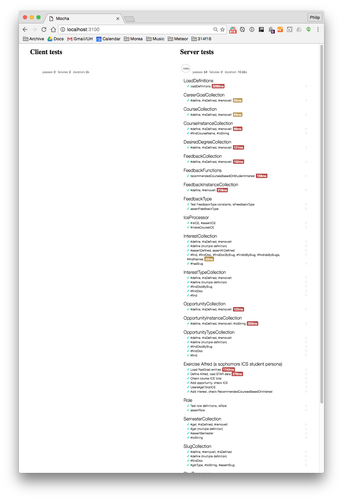
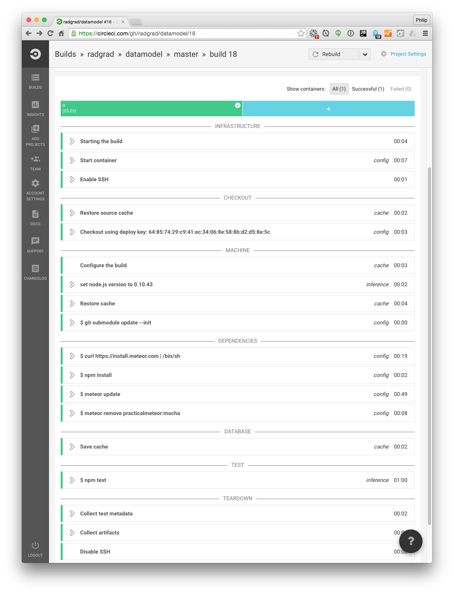

# Testing

This application provides two ways to test: interactively and using continuous integration. 

We use two versions of the [Mocha](https://mochajs.org/) test runner (one for interactive testing, and one for CI) and  [Chai Expect Assertions](http://chaijs.com/guide/styles/#expect). We follow recommendations from the [Meteor Guide Unit Testing Chapter](http://guide.meteor.com/testing.html#unit-testing). 

Each collection class contains its tests in a "sibling" file. For example, tests for SlugCollection.js are located in SlugCollection.test.js.

## Interactive testing (test-watch)

To start up the interactive test process, invoke: 

```
app$ meteor npm run test-watch
```

Interactive testing uses the [practicalmeteor:mocha](https://atmospherejs.com/practicalmeteor/mocha) test driver to start up a parallel Meteor process running at [http://localhost:3100](http://localhost:3100). Here is a screenshot from early in development with only a few tests:
 

 
Note that testing is server-side, because this package does not implement a user interface. 

Also note that it is useful to have the console open along with this test page, because additional error output useful for debugging will occasionally appear here.

As you save changes to your code, the test process will detect changes to the file system, rerun the tests, and automatically refresh this page with the results. 

## Continuous integration (test)

We provide [CircleCI automated builds for the RadGrad Data Model](https://circleci.com/gh/radgrad/datamodel). Each time someone commits to the [master branch of the RadGrad datamodel GitHub repo](https://github.com/radgrad/datamodel), the CircleCI system will clone this branch and run 'lint' and 'test. 

Here is an example build and run of the system:



See the [circle.yml](https://github.com/radgrad/radgrad/blob/master/circle.yml) file for configuration info.

Note that continuous integration in Meteor requires a different Mocha driver called [dispatch:mocha-phantomjs](https://atmospherejs.com/dispatch/mocha-phantomjs), and that if practicalmeteor:mocha is installed when running tests using dispatch:mocha-phantomjs, then certain output is suppressed. To avoid this problem, circle.yml contains a script to remove the practicalmeteor:mocha package when building the system under CI.

Because interactive testing and continuous integration use different mocha driver packages, the test files cannot import Mocha driver functions (i.e. describe, it, before, after) since that would pin these functions to a specific driver package in the code.  To avoid ESLint errors, all test files include the mocha-env ESLint directive.   
 
## Miscellaneous testing issues.

Here are a few issues regarding tests.

* Arrow function use with Mocha is discouraged. See [http://mochajs.org/#arrow-functions](http://mochajs.org/#arrow-functions).

* The standard "test" mode for Meteor (as opposed to "full-app" mode) does not support client subscriptions. So, it doesn't really make sense to try to test the data model on the client side, and thus all data model tests are wrapped in a `Meteor.isServer` block.  Testing of client subscriptions will be done as part of UI testing.

 
